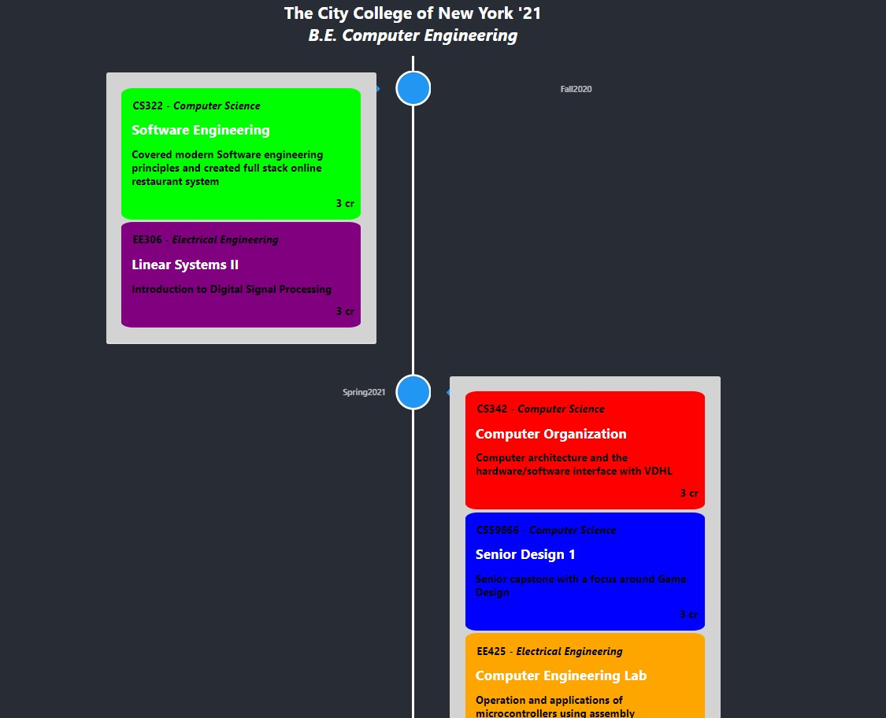

# Curriculum Timeline


Integrated MongoDB with Spring Boot backend. Designed REST API for simple timeline containing courses taken throughout college. 


## Preview

 


## MongoDB setup

- Add the MongoDB dependency in pom.xml 
```
<dependency>
   <groupId>org.springframework.boot</groupId>
   <artifactId>spring-boot-starter-data-mongodb</artifactId>
</dependency>
```

- Configure MongoDB
	- Create mongodb atlas cluster
	- Create New Project >> Build a cluster
		- Go to the Database tab under 'Security' and Add a new database user with a desired password.
		- Next, go to Network Access >> Add an IP Address There should be a button where you can automatically retrieve your IP.
		- Now go back to Clusters and click Connect >> Connect your Application >> Copy 
            - This retrieves the database URI. It is used in the application.properties  to connect to the database.
- In project directory, navigate to src >> main >> resources >> application.properties
		
        spring.data.mongodb.uri=mongodb+srv://<username>:<password>@cluster0.8nzyo.mongodb.net/<dbname>?retryWrites=true&w=majority
        

(Note: Under 'Collections' in the Clusters tab, you can view the data saved.)


